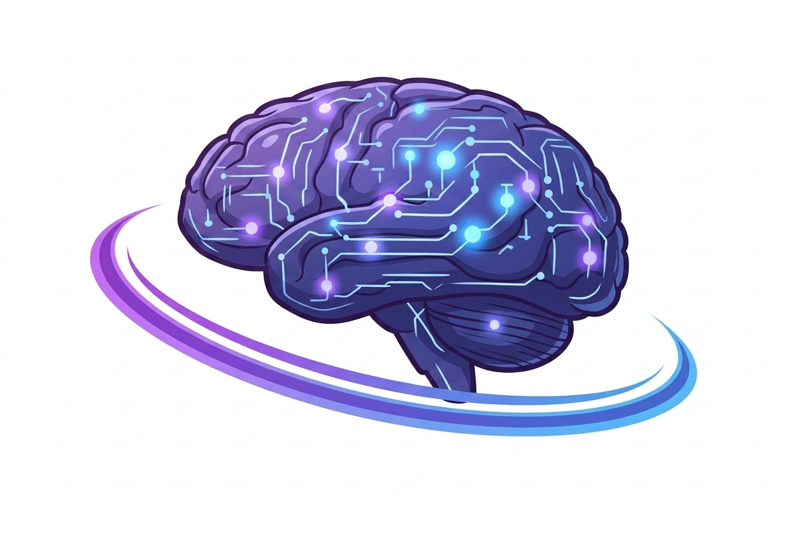

 
 # About OpenGent

OpenGent is building the autonomous intelligence layer for modern data systems.

Today, companies generate enormous volumes of data, yet the systems responsible for interpreting that data remain largely manual, fragmented, and reactive. Analysts build dashboards, teams investigate problems after the fact, and critical signals are often missed.

OpenGent changes this model by embedding AI agents directly into the data stack itself.

Through initial services engagements, we deploy intelligent agents inside customer data environments to monitor pipelines, validate data quality, detect business anomalies, and generate decision-ready insights. These deployments allow us to learn from real-world systems while refining a reusable agent framework that will ultimately evolve into a scalable software platform.

Rather than layering AI on top of dashboards, OpenGent embeds intelligence throughout the entire data lifecycle — from ingestion and transformation to analytics and executive reporting. This approach transforms static reporting environments into adaptive systems that continuously monitor, analyze, and improve themselves.

Our product integrates autonomous and semi-autonomous agents across data pipelines, analytics infrastructure, and operational workflows to deliver:

- AI-powered data pipeline monitoring and validation
- Automated anomaly detection and revenue intelligence
- Agent-driven reporting and executive insight generation
- Governance-aware metric standardization
- Intelligent workflow orchestration across data warehouses and BI systems.